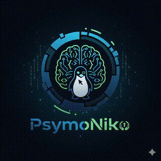

  
  

<!-- Typing animation -->

<!-- NFT logo + link -->

  
   
  <em>🔗 <strong>PsymoNiko</strong> – my verified NFT on TON blockchain</em>

<!-- Social badges -->

  
  
  
  
  

  

---

## 🎵 Interactive Music Player (between two Pokéballs)

  <!-- Left Pokéball -->
  
  
  <!-- Play button that opens the external auto‑hide player -->
  
  
  <!-- Right Pokéball -->
  

  <em>🎧 Click the play button → opens a clean player where the video hides after music starts.</em>

---

<strong>📦 Click to explore my full tech stack & learn more</strong> 🚀

 

# 💻 Tech Stack  

### Languages & Frameworks  

  
  
  
  
  
  
  
  
  
  

### SQL / NoSQL Databases & Storage  

  
  
  
  
  

### Tools & Platforms  

  
  
  
  
  

### CI/CD & Version Control  

  
  
  
  
  

### Operating Systems  

  
  
  
  

---

## 💎 Support with TON

**Wallet:** `alimohammadnia.ton`

If you find my work valuable, you can support me with a TON donation. **0% fees**, direct to my wallet.

---

  

  <em>© 2025 Ali Mohammadnia – Platform Engineer & Creator of PsymoNiko</em>

